## Advanced Lane Finding

In this project, your goal is to write a software pipeline to identify the lane boundaries in a video, but the main output or product we want you to create is a detailed writeup of the project.  Check out the [writeup template](https://github.com/udacity/CarND-Advanced-Lane-Lines/blob/master/writeup_template.md) for this project and use it as a starting point for creating your own writeup.  

The Project
---

The goals / steps of this project are the following:

* Compute the camera calibration matrix and distortion coefficients given a set of chessboard images.
* Apply a distortion correction to raw images.
* Use color transforms, gradients, etc., to create a thresholded binary image.
* Apply a perspective transform to rectify binary image ("birds-eye view").
* Detect lane pixels and fit to find the lane boundary.
* Determine the curvature of the lane and vehicle position with respect to center.
* Warp the detected lane boundaries back onto the original image.
* Output visual display of the lane boundaries and numerical estimation of lane curvature and vehicle position.

## Reflection

### The pipeline I used was based on the logistic and consisted of 6 steps:

1. Calculate the camera calibration matrix and distortion coefficients by the chessboard images
2. For every image input, it'll be processed by the undistort function to eliminate the effect of distortion caused by the camera
3. Apply the perspective transform to top-down view (from a trapezoid roi to rectangle)
4. Transform the image color space to HLS, and utilize the satuation channel to identify the yellow line and the gradient of luminance channel to others. Use the adjusted threshold to binarize the input image
5. Detect the lane pixels within sliding windows (at the first time), and within the polynomial from the following step. When the there's no points found around the polynomial, search again by sliding window
6. With the pixels detected in the previous step, we could fit the points to have quadratic function
7. Determine the curvature of the polynomial lines with the real world measurement
8. Warp the polynomials to the original image (after undistortion) to have a better visualization of the lane line detected
9. Put the radious of the curvature and the the distance of the camera to the center of the road on the image, and render the video

(Original test images:)

---

1.  Undistort the input image.

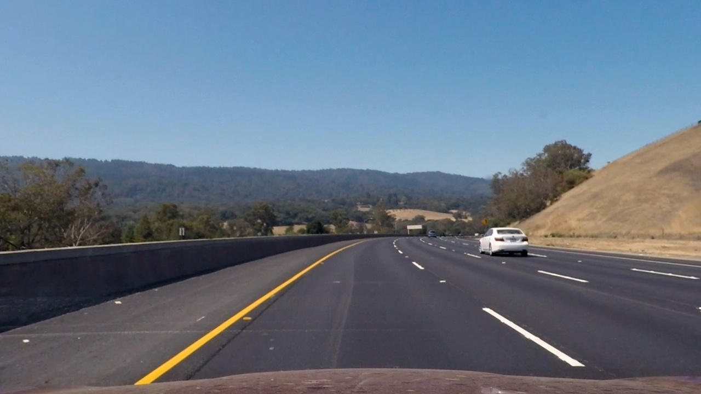
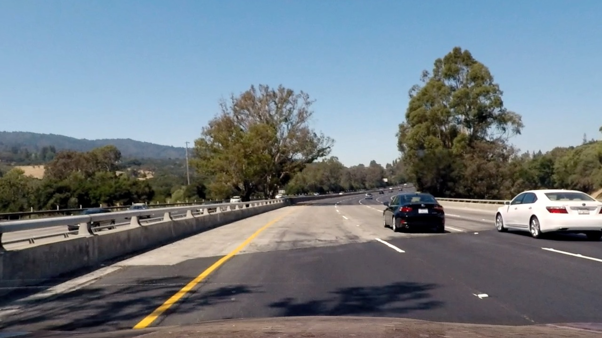

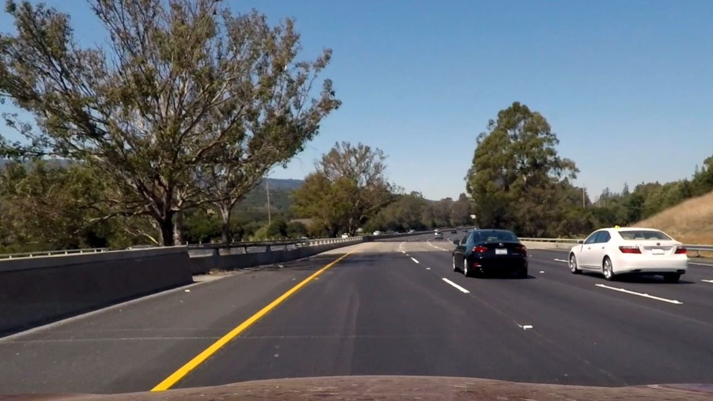

---

2.  Transform the perpective to "bird-eye" view

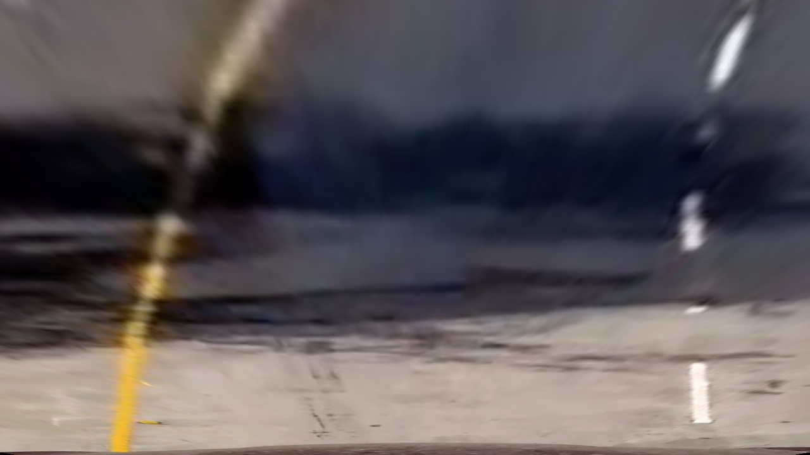
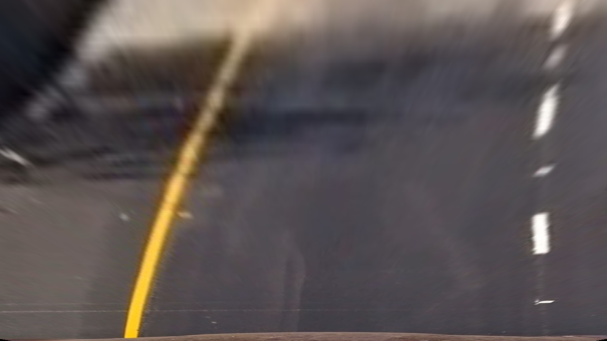

---

3.  Use gradient and color space transform to binarize the image

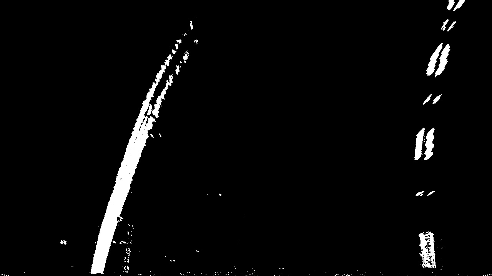

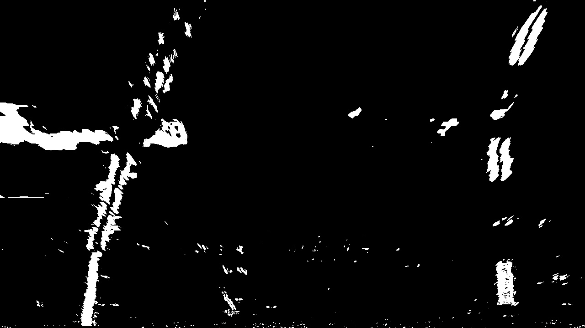

---

4.  Result of the lane-line detection

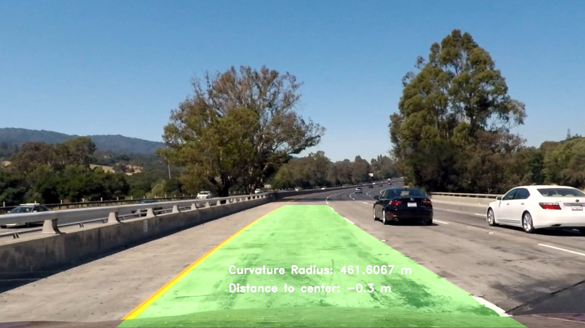
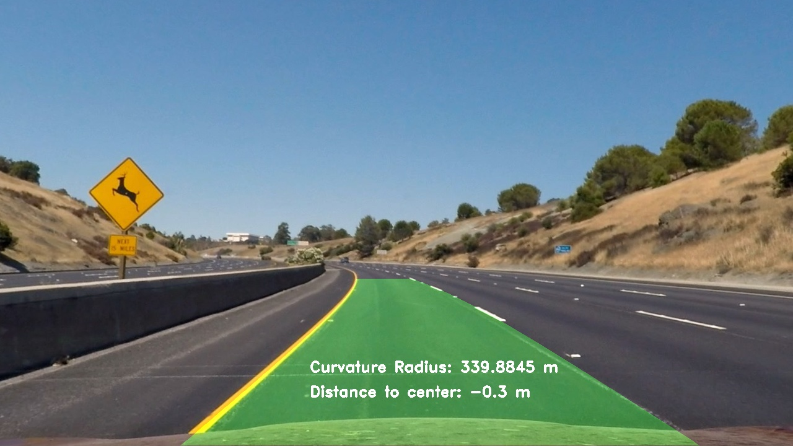
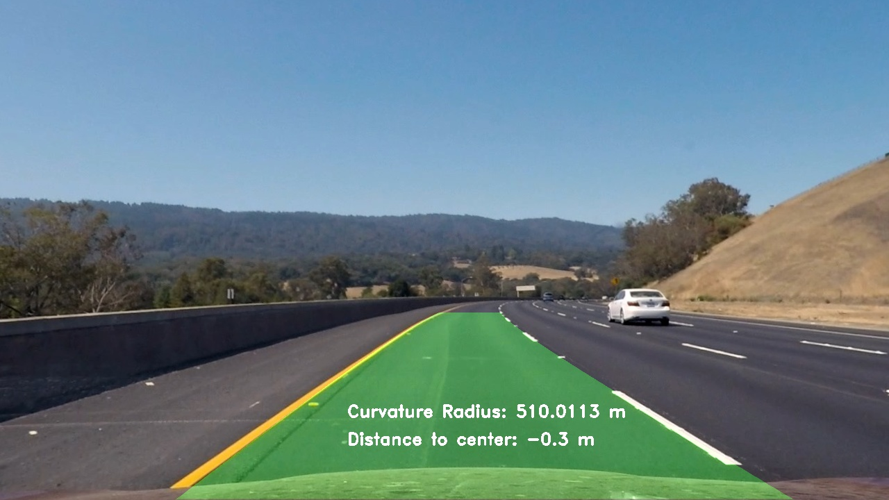
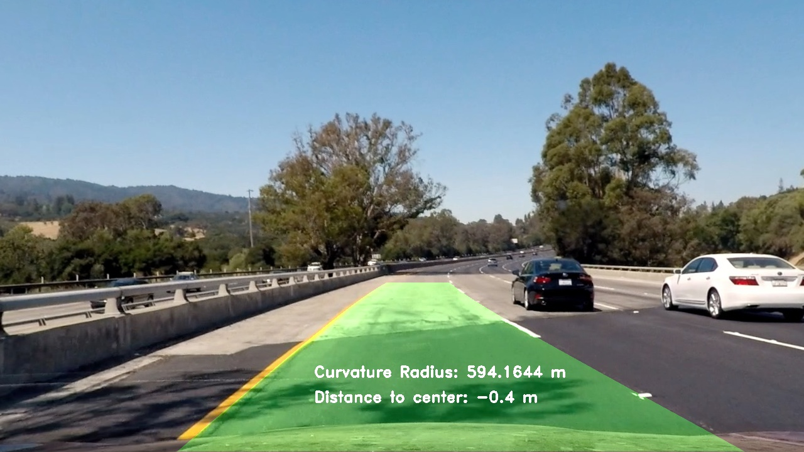

---

### 2. Identify potential shortcomings with your current pipeline

Currently in the middle of the video, the right lane detection was not extremely stable. Some of the noise would affect the final calculation of the polynomial. One potential shortcoming would be like the situation in the challenge video, which has more complicated road image (background). 

### 3. Suggest possible improvements to your pipeline

Need to find maybe a better threshold (parameters) to restrict the detection or add constraints on the detected lines, such as the line distance should be more than 600 pixels.
